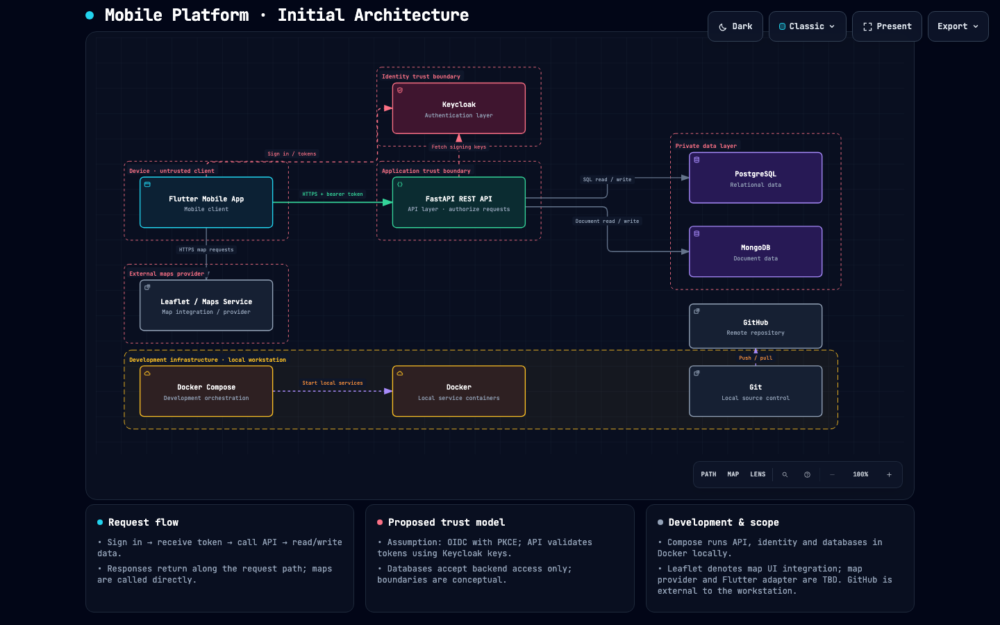

# 📱 Prácticas de Integradora

**Diseño y documentación de una plataforma móvil**

Aplicación móvil · Autenticación · API REST · Bases de datos

[**🌐 Explorar el diagrama interactivo →**](https://fariasdgs.github.io/Practicas_Integradora_230389/Practica02/artifacts/mobile-architecture.html)

---

## 📖 Acerca del repositorio

Este repositorio reúne las prácticas y evidencias de la materia de **Integradora**. Actualmente presenta el diseño inicial de una plataforma móvil y documenta cómo se conectan la aplicación, los servicios de autenticación, el backend y las bases de datos.

El objetivo es comprender la responsabilidad de cada componente, el recorrido de las solicitudes y la separación entre el dispositivo del usuario, los servicios de la aplicación y la información almacenada.

## 🗺️ Arquitectura de la plataforma

El diagrama muestra una propuesta basada en **Flutter**, **FastAPI** y **Keycloak**, con almacenamiento en **PostgreSQL** y **MongoDB**. También incluye la integración de mapas y las herramientas previstas para el entorno de desarrollo.

> Haz clic en la imagen o en el enlace superior para explorar la arquitectura en el navegador.

### Componentes principales

| Componente | Responsabilidad en el diseño |
| --- | --- |
| **Flutter** | Aplicación móvil desde la que el usuario inicia sesión, consume la API y consulta mapas. |
| **Keycloak** | Servicio de autenticación y emisión de tokens para identificar al usuario. |
| **FastAPI** | API REST que autoriza las solicitudes y gestiona el acceso a los datos. |
| **PostgreSQL** | Almacenamiento de información relacional. |
| **MongoDB** | Almacenamiento de información en documentos. |
| **Leaflet / servicio de mapas** | Integración cartográfica; el proveedor y el adaptador para Flutter están por definir. |
| **Docker y Docker Compose** | Ejecución y coordinación de los servicios en contenedores durante el desarrollo local. |
| **Git y GitHub** | Control de versiones y alojamiento del repositorio. |

### 🔄 Flujo de una solicitud

1. El usuario inicia sesión desde la aplicación móvil mediante **Keycloak**.
2. La aplicación obtiene un token y envía solicitudes a **FastAPI** por HTTPS.
3. La API valida el token con las claves de Keycloak y autoriza la operación.
4. El backend consulta o actualiza **PostgreSQL** o **MongoDB**, según el tipo de información.
5. La respuesta regresa a la aplicación para mostrar el resultado al usuario.

Las consultas de mapas se realizan directamente desde el cliente móvil al servicio cartográfico.

### 🔐 Separación de responsabilidades

La propuesta separa el cliente móvil, la identidad, la API y la capa privada de datos. Las bases de datos reciben acceso únicamente desde el backend. El diagrama plantea **OpenID Connect con PKCE** como supuesto para la autenticación.

> **Estado actual:** documentación de arquitectura inicial. El diagrama describe el diseño propuesto; no implica que los servicios ya estén implementados.

## 📂 Archivos de referencia

| Recurso | Descripción |
| --- | --- |
| [Diagrama HTML](artifacts/mobile-architecture.html) | Visor de la arquitectura que puedes abrir en un navegador. |
| [Definición JSON](artifacts/mobile-architecture.json) | Componentes, conexiones y límites definidos en el diagrama. |
| [Vista previa oscura](artifacts/mobile-architecture.visual-check.1440x900.dark.png) | Imagen de referencia con tema oscuro. |
| [Vista previa clara](artifacts/mobile-architecture.visual-check.1440x900.light.png) | Imagen de referencia con tema claro. |

Los recibos de entrega y revisión visual conservados en `artifacts/` corresponden a una versión anterior del HTML: su hash no coincide con el archivo actual. El JSON sí coincide con el recibo de entrega; las capturas anteriores no certifican la presentación actual.

## 🚀 Cómo consultarlo

Abre el [**diagrama publicado en GitHub Pages**](https://fariasdgs.github.io/Practicas_Integradora_230389/Practica02/artifacts/mobile-architecture.html) para explorarlo en línea. También puedes descargar el repositorio y abrir `artifacts/mobile-architecture.html` directamente en tu navegador.
