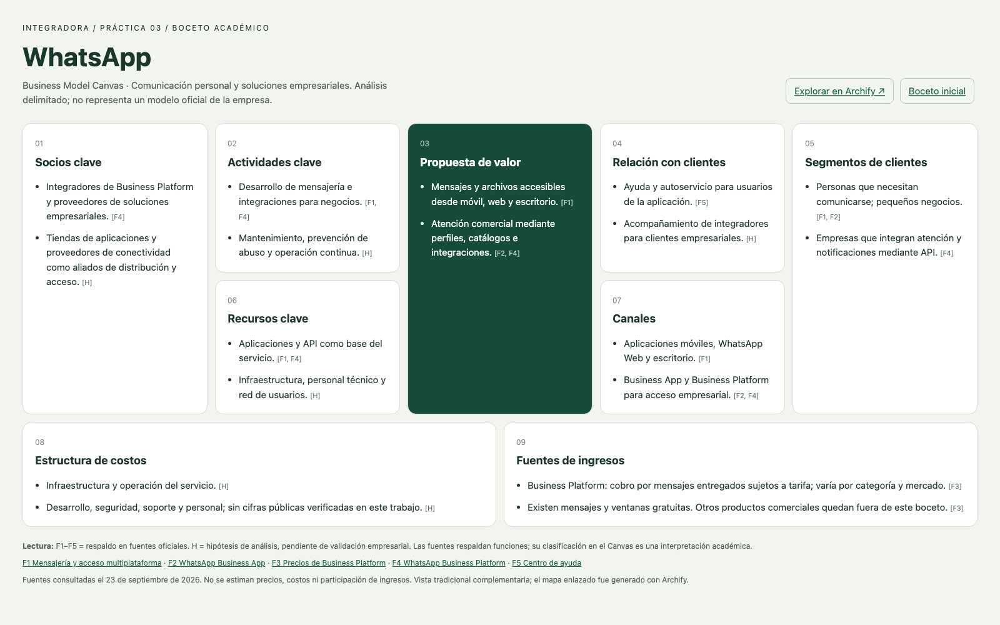

<div align="center">

# Práctica 03 · Modelo Canvas de WhatsApp

**Boceto de modelo de negocio con Archify**

Integradora · Aplicación multiplataforma · Valor de la actividad: 10 firmas

[**Ver Canvas completo →**](https://fariasdgs.github.io/Practicas_Integradora_230389/Practica03/) · [**Explorar en Archify →**](https://fariasdgs.github.io/Practicas_Integradora_230389/Practica03/artifacts/canvas-final.html)

</div>

## Acerca de la práctica

Esta práctica analiza el modelo de negocio de WhatsApp mediante los nueve bloques del Business Model Canvas. Documenta la elección de la aplicación, el prompt inicial, la revisión del primer resultado y la mejora del prompt hasta obtener el modelo final.

[](https://fariasdgs.github.io/Practicas_Integradora_230389/Practica03/)

### Explorar los resultados

| Resultado | Qué encontrarás |
| --- | --- |
| [Canvas tradicional](https://fariasdgs.github.io/Practicas_Integradora_230389/Practica03/) | Los nueve bloques con explicaciones, fuentes e hipótesis en la distribución clásica del Canvas. |
| [Modelo final en Archify](https://fariasdgs.github.io/Practicas_Integradora_230389/Practica03/artifacts/canvas-final.html) | Mapa resumido de los nueve bloques, con controles de tema, zoom y exportación. |
| [Boceto inicial en Archify](https://fariasdgs.github.io/Practicas_Integradora_230389/Practica03/artifacts/canvas-inicial.html) | Primera versión conservada para comparar las mejoras. |

Los enlaces de esta tabla abren las páginas publicadas. Los archivos editables y la documentación se encuentran al final de la actividad 5.

## 1. Elección de la aplicación

Se eligió WhatsApp por su utilidad para comunicación personal y comercial y su acceso desde dispositivos móviles, web y escritorio [F1]. Como ejemplo de uso cotidiano, permite coordinar un equipo escolar y compartir archivos desde el teléfono o la computadora.

El alcance comprende mensajería personal, Business App y Business Platform. El análisis es un boceto académico, no el modelo oficial ni un inventario completo de negocios de Meta. No se asume igualdad de funciones entre dispositivos.

## 2. Prompt inicial y generación

Se redactó el [prompt inicial](prompts/01-inicial.md). Se tradujo su solicitud a una especificación JSON y se generó el [primer HTML con Archify](https://fariasdgs.github.io/Practicas_Integradora_230389/Practica03/artifacts/canvas-inicial.html). Archify renderiza JSON: el prompt orienta al asistente que prepara la especificación; no se presenta como una API de texto de la herramienta.

La versión instalada de Archify no tiene un esquema nativo para Business Model Canvas. Se adaptó el tipo `architecture` como mapa de nueve categorías, sin conexiones: los bloques no representan pasos secuenciales. Los tipos técnicos internos no atribuyen infraestructura a WhatsApp. La interfaz fija y el atributo `html lang` del visor Archify usan inglés por limitación del generador; el contenido académico está en español.

## 3. Revisión del primer resultado

| Criterio | Hallazgo inicial | Mejora aplicada |
| --- | --- | --- |
| Cobertura | Contiene nueve bloques | Se conservan los nueve |
| Precisión | “Personas y empresas” mezcla segmentos | Se distinguen personas, pequeños negocios y empresas con API |
| Ingresos | “Servicios para empresas” es ambiguo | Se indica cobro de mensajes sujetos a tarifa y excepciones |
| Evidencia | El boceto no cita fuentes | Se agregan F1–F5 y marcas H |
| Costos | No explica categorías ni incertidumbre | Se describen categorías como hipótesis, sin cantidades |
| Presentación | Cuadrícula de bloques, no disposición tradicional | Se agrega una vista tradicional complementaria |

El primer resultado era útil como estructura, pero insuficiente para explicar el negocio. La revisión permitió precisar el alcance y mejorar la explicación de cada bloque.

## 4. Prompt mejorado y modelo final

El [prompt mejorado](prompts/02-mejorado.md) añade alcance, segmentos, fuentes, hipótesis y formato. Se obtuvo un [mapa final de Archify](https://fariasdgs.github.io/Practicas_Integradora_230389/Practica03/artifacts/canvas-final.html) y una [vista tradicional](https://fariasdgs.github.io/Practicas_Integradora_230389/Practica03/) con el desarrollo completo.

**Cómo leer las referencias:** F1–F5 remiten a las [fuentes oficiales](#fuentes); H identifica una hipótesis académica que requiere validación.

### Socios clave

- Integradores de Business Platform y proveedores de soluciones empresariales. [F4]
- Tiendas de aplicaciones y proveedores de conectividad como aliados de distribución y acceso. [H]

### Actividades clave

- Desarrollo de mensajería e integraciones para negocios. [F1, F4]
- Mantenimiento, prevención de abuso y operación continua. [H]

### Propuesta de valor

- Mensajes y archivos accesibles desde móvil, web y escritorio. [F1]
- Atención comercial mediante perfiles, catálogos e integraciones. [F2, F4]

### Relación con clientes

- Ayuda y autoservicio para usuarios de la aplicación. [F5]
- Acompañamiento de integradores para clientes empresariales. [H]

### Segmentos de clientes

- Personas que necesitan comunicarse; pequeños negocios. [F1, F2]
- Empresas que integran atención y notificaciones mediante API. [F4]

### Recursos clave

- Aplicaciones y API como base del servicio. [F1, F4]
- Infraestructura, personal técnico y red de usuarios. [H]

### Canales

- Aplicaciones móviles, WhatsApp Web y escritorio. [F1]
- Business App y Business Platform para acceso empresarial. [F2, F4]

### Estructura de costos

- Infraestructura y operación del servicio. [H]
- Desarrollo, seguridad, soporte y personal; sin cifras públicas verificadas en este trabajo. [H]

### Fuentes de ingresos

- Business Platform: cobro por mensajes entregados sujetos a tarifa; varía por categoría y mercado. [F3]
- Existen mensajes y ventanas gratuitas. Otros productos comerciales quedan fuera de este boceto. [F3]

**Coherencia del modelo:** los canales permiten entregar comunicación personal y atención comercial. Las empresas con necesidades de integración constituyen un segmento monetizable mediante Business Platform. Los recursos y actividades propuestos explican las categorías de costos como hipótesis, sin atribuir presupuestos internos a la empresa.

## 5. Documentación y buenas prácticas

- Rama de trabajo: `practica03`.
- Prompts y JSON conservados para reproducibilidad; primera versión preservada.
- Enlaces de GitHub Pages para los resultados visuales y enlaces relativos para la documentación y los archivos fuente.
- HTML autocontenido de Archify y vista tradicional sin dependencias externas de ejecución.
- Evidencias de validación separadas de la revisión del contenido.

### Archivos y evidencias

| Archivo | Propósito |
| --- | --- |
| [Prompt inicial](prompts/01-inicial.md) | Solicitud utilizada para preparar el primer boceto. |
| [Prompt mejorado](prompts/02-mejorado.md) | Solicitud con alcance, fuentes y criterios de presentación. |
| [JSON inicial](artifacts/canvas-inicial.json) | Especificación del primer mapa de Archify. |
| [JSON final](artifacts/canvas-final.json) | Especificación editable del mapa final. |
| [Contenido del Canvas](artifacts/contenido-canvas.json) | Ideas por bloque y referencias de respaldo. |
| [Captura del Canvas](artifacts/canvas-tradicional.png) | Vista previa de la distribución tradicional. |
| [Validación](VALIDACION.md) | Comprobaciones realizadas y alcance de la revisión visual. |
| [Recibo de entrega](artifacts/canvas-final.delivery.json) | Resultado de las nueve comprobaciones de Archify e identidad de los archivos. |

**Verificación realizada:** 9/9 comprobaciones de Archify, sin errores ni advertencias; comprobación de navegador en cuatro tamaños de escritorio y revisión de las capturas descritas en la validación.

### Consulta local

Descarga o clona el repositorio y abre `Practica03/index.html` en tu navegador. Para consultar el visor directamente, abre `Practica03/artifacts/canvas-final.html`.

### Reproducción

Ejecuta estos comandos desde la raíz del repositorio, con Node.js y la habilidad Archify instalada. Sustituye `/ruta/a/archify` por el directorio de la habilidad:

```sh
node "/ruta/a/archify/bin/archify.mjs" validate architecture Practica03/artifacts/canvas-final.json --quality showcase --json
node "/ruta/a/archify/bin/archify.mjs" deliver architecture Practica03/artifacts/canvas-final.json Practica03/artifacts/canvas-final.html --quality showcase --json
node "/ruta/a/archify/bin/archify.mjs" visual-check Practica03/artifacts/canvas-final.html --json
```

La publicación actual utiliza la rama `main` y la carpeta `/ (root)` en GitHub Pages. La entrada del repositorio abre el mapa final de Archify; el Canvas tradicional tiene su propia dirección en `Practica03/`.

**Después del merge:** sube la fusión a `main` en GitHub y espera a que termine el despliegue de Pages. El origen ya está configurado en `main` y `/ (root)`. Las direcciones del Canvas y Archify seguirán siendo las mismas.

## Fuentes

Consulta: 23 de septiembre de 2026. F = fuente oficial; H = hipótesis académica. La selección y ubicación de cada idea en el Canvas son interpretación del análisis.

- **F1**: [Mensajería y acceso multiplataforma](https://www.whatsapp.com/messaging?lang=en).
- **F2**: [WhatsApp Business App](https://whatsappbusiness.com/products/business-app/).
- **F3**: [Precios de Business Platform](https://whatsappbusiness.com/products/platform-pricing/).
- **F4**: [WhatsApp Business Platform](https://whatsappbusiness.com/products/business-platform/).
- **F5**: [Centro de ayuda](https://faq.whatsapp.com/).

## Conclusión

Un prompt general produjo un mapa correcto en estructura, pero poco específico. Añadir segmentos, alcance, evidencia y criterios de presentación permitió explicar mejor el valor y la monetización. La gratuidad de funciones personales no implica ausencia de ingresos empresariales. Las hipótesis de costos y recursos requieren información interna para validarse.

## Entrega académica

Antes de presentar, revisa el análisis y adapta el ejemplo de uso cotidiano a tu experiencia. Las 10 firmas corresponden a la evaluación del docente.

[← Volver al índice de prácticas](../README.md)
